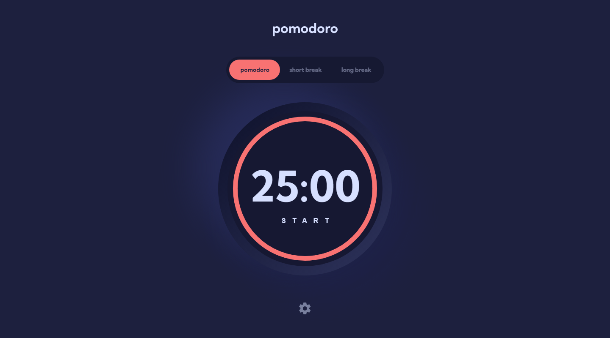

# Pomodoro Timer App

## Challenge

Your users should be able to:

- Set a pomodoro timer and short & long break timers
- Customize how long each timer runs for
- See a circular progress bar that updates every minute and represents how far through their timer they are
- Customize the appearance of the app with the ability to set preferences for colors and fonts### Links

## Links

- [Solution]()
- [Live Site]()

## Built with

- ReactJS
- [Recoil](https://recoiljs.org/)
- CSS Styled Components
- Desktop-first workflow

## Author

- Frontend Mentor [@Isaiah-B](https://www.frontendmentor.io/profile/Isaiah-B)